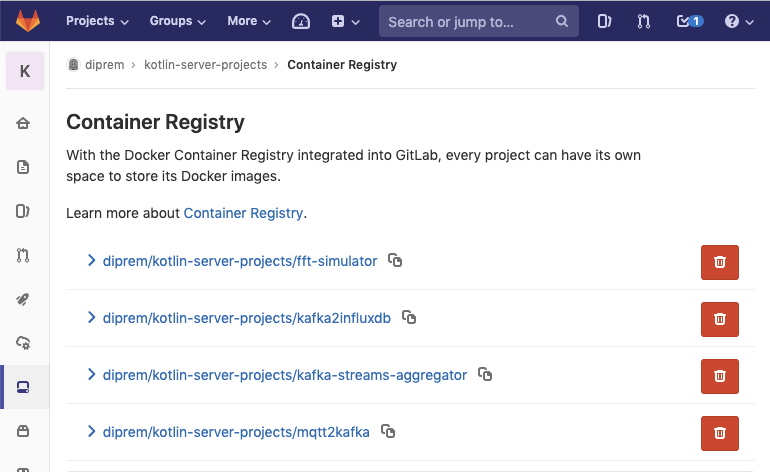

# Docker Crashkurs

[TOC]


> Docker is a set of coupled software-as-a-service and platform-as-a-service products that use operating-system-level virtualization to develop and deliver software in packages called containers. The software that hosts the containers is called Docker Engine It was first started in 2013 and is developed by Docker, Inc The service has both free and premium tiers.
>
> Containers are isolated from each other and bundle their own software, libraries and configuration files; they can communicate with each other through well-defined channels. All containers are run by a single operating-system kernel and are thus more lightweight than virtual machines. Containers are created from images that specify their precise contents. Images are often created by combining and modifying standard images downloaded from public repositories. ([en.wikipedia.org](https://en.wikipedia.org/wiki/Docker_(software)))
>


*[Bild: Vergleich Docker Container (Links) und Virtuelle Maschine (Rechts)](https://blog.docker.com/2018/08/containers-replacing-virtual-machines/)*


## Docker Container

Docker Container … 

- hat eine virtuelle Netzwerkschnittstelle
- kann (standardmässig) mit der aussenwelt kommunizieren
- kann [Ports nach aussen öffnen](https://docs.docker.com/engine/reference/run/#expose-incoming-ports) (wie bei NAT)
- kann Dateien/Laufwerke/Ordner und Docker Volumen von Hostsystem in den Container mounten
- kann Werte für Container [Umgebungsvariable annehmen](https://docs.docker.com/engine/reference/run/#env-environment-variables)
- ist die [Instanzierung eines Docker Images](https://docs.docker.com/engine/reference/run/) (Analogie aus der Programmierwelt: Docker Images sind die Klassen und Containers sind die Instanzen)
- verwendet ein Overlay Dateisystem. Dadurch wird nur die Delta der Datenveränderung am Docker Image in eine separate Datei geschrieben. D.h. wenn wir 1000 Container derselben Image erstellen, benötigen wir nicht 1000x mehr Platz.
- können [gestoppt](https://docs.docker.com/engine/reference/commandline/stop/), [weitergeführt](https://docs.docker.com/engine/reference/commandline/start/) oder [gelöscht](https://docs.docker.com/engine/reference/commandline/rm/) werden. Beim löschen des Containers wird das angehängte Docker Volumen nicht gelöscht.

In einem Docker Container wird in der Regel EINE Applikation ausgeführt. Benutzerdefinierte Applikationskonfiguration kann, sofern von Docker Container Entwickler unterstützt wird, einfach über die Container Umgebungsvariable konfiguriert werden.

Populäre Docker Containers (siehe https://hub.docker.com) können in der Regel über Container Umgebungsvariable konfiguriert werden.


## Docker Image

Docker Image ...

- werden durch builden der `Dockerfile` generiert ([Dockerfile Referenz](https://docs.docker.com/engine/reference/builder/)).
- Bestehen aus mehreren Schichten von Image bzw. referenzieren auf ein anderen Image (Ausnahme: Docker Base Image)
- Können auf öffentlichen (bsp. hub.docker.com) oder privaten (bsp.: FHNW Gitlab und gitlab.com bietet Registry für jeden Git Repository) Registry bereitgestellt werden. Für die Kommunikation mit der privaten Repository muss zuerst via `docker login` angemeldet werden.
- Können auf die Repository gepusht bzw. gepullt werden.


```dockerfile
# Basis Image auswählen
FROM mcr.microsoft.com/java/jre:11u2-zulu-alpine

# Dateien zu Image hinzufügen (Zielpfad ist image spezifisch)
ADD mqtt2kafka.tar /opt/mqtt2kafka

# Arbeitsverzeichnis für Image definieren
WORKDIR /opt/mqtt2kafka/mqtt2kafka/

# Standardbefehl für die Ausführung bei Containerstart definieren
CMD sh bin/mqtt2kafka
```

*Listing: Beispiel Dockerfile aus mqtt2kafka Projekt (Java/Kotlin)*


```bash
IMAGE=cr.gitlab.fhnw.ch/diprem/kotlin-server-projects/mqtt2kafka
gradle clean && gradle distTar
cd build/distributions
docker build --no-cache -f ../../Dockerfile -t $IMAGE .
```

*Listing: Beispiel Befehl zur Erstellung von Docker Image aus Dockerfile*


## Docker Registry



*Bild: Gitlab Projekt Docker Registry*


Docker Registry dient als Ablage für Docker Images. Die Image können optional ge-tagged (bzw. versioniert) werden wie in einer Gitablage.

Die Docker Images im Docker Registry haben ein vorgegebenes Namenssystem, welches bereits bei der erstellung von Docker Image berücksichtigt werden muss. Nachfolgend werden 4 verschiedene Namensbeispiele für FHNW Gitlab `DiPrem` Projektgruppe und Projekt `kotlin-server-projects` aufgelistet:

```
cr.gitlab.fhnw.ch/diprem/kotlin-server-projects
cr.gitlab.fhnw.ch/diprem/kotlin-server-projects:tag
cr.gitlab.fhnw.ch/diprem/kotlin-server-projects/optional-image-name:tag
cr.gitlab.fhnw.ch/diprem/kotlin-server-projects/optional-name/optional-image-name:tag
```


Vor Datenaustausch mit der privaten Repository muss das Hostsystem sich über das docker-cli authentifizieren. Dies geschieht mit dem Befehl `docker login cr.gitlab.fhnw.ch` (für FHNW Gitlab).

## Docker Compose

Docker Compose ist ein Werkzeug für die Verwaltung mehrerer Docker Anwendun-
gen. Die Konfigurationen werden standardmässing in eine Datei namens `docker-compose.yml`
in YAML-Format abgelegt. Nach der Definition kann mit einem einzigem Befehl alle Container-
Anwendungen verwaltet werden (z.Bsp. alle hochfahren, herunterfahren etc.)


Die Docker-Compose Datei beginnt mit der Deklaration der zu verwendenden Docker-Compose
Version. Danach wird die Datei in drei Teile unterteilt:

* Services: Definiert Dienste (Image, Restriktionen, Konfigurationen, etc.)
* Networks: Konfiguriert virtuelle Netzwerke für Docker Container
* Volumes: Definiert Volumen für die Verwendung durch Services


Die Servicedefinition beinhaltet unteranderem folgendes

- image: Zuverwendente Image für die Container Erstellung
- container_name: Name des Containers
- restart: Startverhalten des Containers (bsp. bei Fehlerfall neustarten)
- mem_limit: RAM Limmit (nur bei v 2.4 Docker Compose)
- cpus: CPU Limmit (nur bei v 2.4 Docker Compose)
- ports: Mapping von Host Port zu Container Port
- volumes: Mapping von Datei/Ordner in den Container Pfad. Kann auch als Readonly deklariert werden.
- environment: Definition von Umgebungsvariablen
- networks: Zuordnung von Netzwerk (optional: Für benutzerdefiniertes Netzwerk)
- extra_hosts: Definition für `/etc/hosts` Datei im Container


Weitere Informationen zu Docker Compose Definition auf https://docs.docker.com/compose/compose-file/


```yaml
version: '3'
services:
  fft-simulator:
    image: cr.gitlab.fhnw.ch/diprem/kotlin-server-projects/fft-simulator
    container_name: fft-simulator
    volumes:
      - $ENV_FILE:/.env
      - $SIMULATOR_CSV_FFT_FILE:/data.csv
    environment:
      - SIMULATOR_CSV_FFT_FILE=/data.csv

  kafka2influxdb:
    image: cr.gitlab.fhnw.ch/diprem/kotlin-server-projects/kafka2influxdb
    container_name: kafka2influxdb
    volumes:
      - $ENV_FILE:/.env
    extra_hosts:
      - "mqtt.ketag.io:${IP_MQTT}"      

  kafka-streams-aggregator:
    image: cr.gitlab.fhnw.ch/diprem/kotlin-server-projects/kafka-streams-aggregator
    container_name: kafka-streams-aggregator
    environment:
      - INFLUXDB_MEASUREMENT=aggregation
    volumes:
      - $ENV_FILE:/.env
    extra_hosts:
      - "mqtt.ketag.io:${IP_MQTT}"

  mqtt2kafka:
    image: cr.gitlab.fhnw.ch/diprem/kotlin-server-projects/mqtt2kafka
    container_name: mqtt2kafka
    volumes:
      - $ENV_FILE:/.env
    extra_hosts:
      - "mqtt.ketag.io:${IP_MQTT}"
```

*Listing: Beispiel Docker Compose File aus kotlin-server-projects (Java/Kotlin).*

### Administration

#### Docker Compose File Auswahl

Alle `docker-compose` Befehle beziehen sich auf die `docker-compose.yml` Datei in der aktuellen Arbeitsverzeichnis bezogen. 

Für die Auswahl eines anderen Docker-Compose Datei kann der Befehlt wie folgt ausgeführt werden:

```
docker-compose -f [filename] [command]
```

#### Alle Dienste erstellen und starten

```
docker-compose up -d
```

Der Parameter `-d` entkoppelt die Ausführung von der Konsole, so dass mit dem Terminal weiter gearbeitet werden kann.

#### Alle Dienste entfernen

```
docker-compose down
```

#### Alle Dienste stoppen

```
docker-compose stop
```

#### Alle Dienste starten

```
docker-compose start
```

#### Logs aller Dienste anzeigen und folgen

```
docker-compose logs -f
```

#### Bestimmten Dienst ausführen

```
docker-compose run --rm --service-ports [service name]
```

Der Parameter `--rm` teilt dem Docker Dienst mit den Container nach der Beendigung zu löschen.

Der Parameter `--service-ports` teilt dem Docker Dienst mit die definierten Ports nach aussen zu öffnen.

#### In die Konsole eines laufenden Containers einklinken

```
docker exec -it [service name] bash
```
Mit `bash` wird bash-Shell gestartet. Falls diese nicht existiert mit `sh` versuchen. 

#### Compose Datei validieren

```
docker-compose config --services
```

https://docs.docker.com/compose/reference/config/

### Resourcen Eingrenzen

In v3 von Docker-Compose File können Limitten für Resourcen *(für Nicht-Swarm-Mode)* nicht gesetzt werden. Für die Eingrenzung der Ressourcen kann auf v2.4 ausgewichen werden (Empfehlung in der aktuellen Docker Dokumentation). Die möglichen Einschränkungen sind [hier](https://docs.docker.com/compose/compose-file/compose-file-v2/#cpu-and-other-resources) dokumentiert. Beschreibung der Konfigurationsparameter sind [hier](https://docs.docker.com/config/containers/resource_constraints/) zu finden.


### ENV-File

Einige Werte im Docker Compose File können umgebungsspezifisch sein. Die Umgebungsvariablen können in eine `.env` Datei ausgelagert und in Docker Compose File referenziert werden. Mehr Information auf https://docs.docker.com/compose/env-file/


```ini
ENV_FILE=/Users/robert.rajakone/repos/2018_diprem/kotlin-server-projects/.env
SIMULATOR_CSV_FFT_FILE=/Users/robert.rajakone/repos/2018_diprem/export_2019-03-19.csv
IP_MQTT=186.19.41.23
```

*Listing: Beispiel Environment-Datei (`.env`) für kotlin-server-projects Docker Compose File*

### Bemerkung zu Volumen
Es scheint so, als werden die automatisch generierten Docker Volumen (gemäss Definition im Dockerfile oder Docker-Compose) mit ein Präfix versehen, welches den Ordnernamen des Docker-Compose File entspricht. Deshalb ist es gut möglich, dass das Volumen nicht mehr gefunden wird, wenn die Docker-Compose Datei auf dem Filesystem verschoben wird. Möglicherweise kann man einfach den Namen des Docker Volumens anpassen.


## Weitere Docker Befehle

Nicht verwendeten Images von Hostsystem entfernen:

```
docker images prune
```


Alle GESTOPPTEN containers entfernen (VORSICHT!)

```
docker container prune 
```


Alle Volumen NICHT IN VERWENDUNG entfernen (VORSICHT!)

—> (GUT Überlegen!)


```
docker volume prune
```


