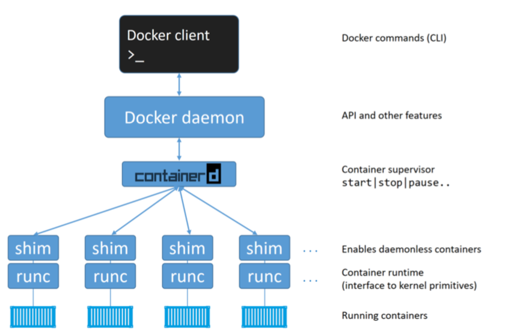
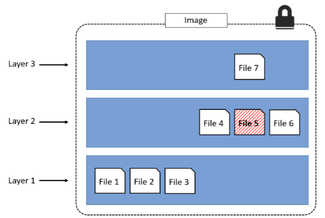
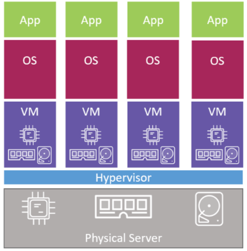
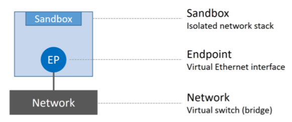
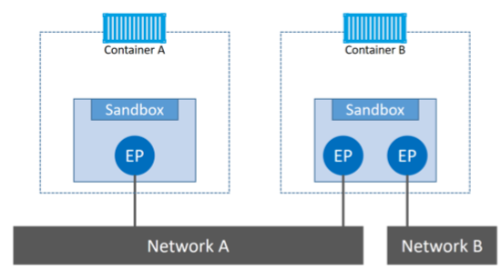
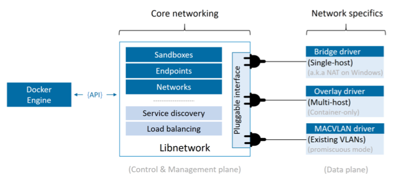

# Notes: Docker Deep Dive
## Chapter 1
  * Developement
    * one app per server
    * VMware (need own OS, patching, licensing, extra power CPU/RAM, portability etc.)
    * Google etc. using containers (no own OS, No licensing, No Overhead Patching and other maintence, fast)
    * Linux containers (major enabling technologies: kernel namespaces, control groups, union filesystem ...)
    * Docker: Linux containers was very complex.  Docker democratized and made it accessible to the masses
    * Windows container: MS hardworks to bring Docker and container technology to windows platform
  * Windows containers vs. Linux containers
    * Developing fast
    * Is currently restricted to refering OS
    * No mac containers: Works by seamlessly runnuing containers inside of lightweight linux VM on mac.
  * Versions
    * Docker for Mac (uses HyperKit to implement extremely lightweight hypervisor, uses hilghly tuned linux distro called MOBY that is based on alpine Linux)
    * Docker for Linux
    * Docker for Windows (Win 10, Server 2016)
  * Batteries included, but exchangable: Can exchange network, storage driver etc. and make significant impact on performance

Installation
  * Using docker as non-root user: `sudo usermod -aG docker your-user``
  * Best storage driver: `overlay2` (Ubuntu kernel 4.x+). Each driver has its own directory for images and volumes(?). So reconfiguration of containers and image is requried.

# Chapter 4
  * OPS
    * On Linux, client talk via IPC/Unix socket to daemon (`/var/run/docker.sock`)
    * On Windows, it uses (`npipe:////./pipe/docker_engine`)
    * see `docker version``
  * Images = OS filesystem + application (effectivly, a stopped container). Other names: class, template

## Chapter 5 / Technical
  * First docker was depending on LXC

* containerd ("container-dee"), (linux: `docker-containerd`)
  * purpose: manage container lifecycle operations (start, stop, pause, rm, ...)
  * sits between daemon and runc at the OCI Layer
  * now has more functionalitie
    * manage images (push/pull images)
* daemon (linux: `dockerd`)
  * Implements REST API
  * daemon communicates with containerd via CRUD-Style API over gRPC
  * functionalities: image management, image builds, the REST API, authentication, security, core networking, and orchestration
* runc (linux: `docker-runc`)
  * OCI reference impl. for container-runtime-spec
  * CLI Wrapper for libconainer (replaces LXC)
  * purpose: creating containers
  * intercaes with OS kernel
  * pull all constructs together to create containers (namespaces, cgroups etc.)
  * container process is started as child process of runc. As soon container is started runc will exit.
* shim (linux: `docker-containerd-shim`)
  * As soon as runc is exited after container creation, shim becomes parent of process
  * it keeps any STDIN and STDOUT streams open so that when the daemon is restarted, the container doesn't terminate due to pipes being closed etc. 
  * reports container's exit status back to daemon

So these are "daemonless-containers". It makes possible to performance maintenance and upgrades on Docker daemon without impacting running containers!

## Chapter 6: Images

### Containers

- runtime construct

### Images

* buildtime construct
* contains no kernel
  * uses kernel of host system
  * os-related files and filesystem objects
  * Hyper-V containers run inside of dedicated lightweight VM and leverage the kernel of the OS running inside the VM
  * alpine linux is about 4mb
  * ubuntu image is about 110mb
  * latest ms .net image is over 1.7GB
  * Windows Server 2016 Nano Server is about 1GB
* default image location
  * linux: `/var/lib/docker/<storage-driver>`
  * windows: `C:\ProgramData\docker\windowsfilter`
* `docker image ls`
* tags
  * like git repositories
  * one image can have multiple tags
  * can be overwritte (use diggest for unique identification)

### Image Registry

* One registry can have multiple repositories
* docker hub
  * official repositories is on `hub.docker.com/_/...`
  * unofficial repositories: `hub.docker.com/r/...`
* docker search alpine`

### Manifeset

* optionally - allows to have different images for one tag
* registry can return (if available) appropriate image to the architecture of requesting client

# Chapter 7: Containers

VMs:

*VM Tax / OS Tax*

* multiple VM consume CPU, RAM, Disk Spaces
* multiple Licensing
* multiple Patch Works / Maintenance
* multiple attach surface
* multiple startup-time

Containers:

Container Tax

* single OS Kernel running
* single os consuming CPU/RAM/Storage
* single os need licensing
* single OS need upgrading/patching
* single OS kernel presenting an attach surface
* almost no startup time (less than second)
* diskspace only for images and additional data layer

# Chapter 8: Containerize app

* prevent caching: `--no-cache=true`
* squashing: merging all layers to one
  * not best practise. has pros and cons (`docker image build ... --squash`)
  * space inefficiency (has also sent a whole new big layer to registry)
* `no-install-recommands`-flag use it when installing with `apt-get install` to keep the size small
* do not install from MSI Package (windows)
* Descriptors
  * EXPOSES: Documentations purpose
  * Entrypoint: default app to run
  * copy: transfer application code (new layer)
  * run: run cmds inside the layer (new layer)

# Chapter 9: Deploy Apps with Docker Compose

separate python binary

# C11: Networking

Docker Networking contains 3 major components

* Container Netowrk Model (CNM): is design specification
  * sandboxes: islolated network stack. Includes eth. if, ports, routing tables and dns config
  * endpoints: virtual network if. 
  * networks: software impl. of 802.1d bridge (switch). Group together and isolate a collection of endpoints that need to communicate
* `libnetwork`
  * real-world impl. of CNM

* drivers
  * extends the model by impl. specific network topoligies such as VXLAN-based overlay networks
  * is in charge of actual creation an dmanagement of all resources on the network
  * multiple drivers can be active
  * docker ships with several built-in drivers
    * linux: bridge, overlay, macvlan
    * win: nat, overlay, transparent, l2bridge
  * Types
    * Single-host bridge: connects containers on same host
      * builds on linux bridge technology (15years experience)
      * default bridge map the underlying linux bridge `docker0`
    * Multi-host overlay networks
      * enables containers to communicate between different hosts

Checking connectivity issues:

* /var/log/daemon.log 
* ∼/Library/Containers/com.docker.docker/Data/com.docker.driver.
       linux/console-ring
* setting docker log level: `daemon.json`

Ports

* check: `docker port CONTAINER-ID`

Service Discovery

* Docker DNS server holds name-to-IP mappings for all containers created with `--name` or `--net-alias` flags
* Can customize discovery: `docker container run -it --name c1 --dns=8.8.8.8 --dns-search=dockercerts.com alpine sh`

# Links

  * https://play-with-docker.com/