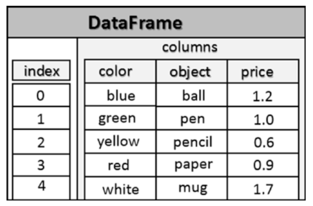

# Pandas
Note: Immutable structure. But some operations (`+= `, inplace-Switch for ops.) allows replacing original structure.

## CSV

### Reading

```python
df = pd.read_csv('filename.csv', index_col=0, skiprows=1)
```


## Series

* can be seen as a dictionary
* contains an array of index and and array of values

```python
import pandas as pd

# creating with default index
mydict = {'red': 2000, 'blue': 1000, 'yellow': 500, 'orange': 1000}
myseries = pd.Series(mydict)

s = pd.Series([12,-4,7,9])

# creating with custom index
s = pd.Series([12,-4,7,9], index=['a','b','c','d'])

s.index
s.values

# accessing value by index like in nupy
s[2]

# accessing value by defined custom index
s['a']

s[1] = 1
s['a'] = 1

# creating serie from serie
# NOTE: THIS IS A REFERENCE AND NOT A COPY!
s2 = pd.Series(s)

# filtering
s[s > 8]

# operations like in nupy
s/2
np.log(s)

# can have duplicate index
serd = pd.Series([1,0,2,1,2,3], index=['white','white','blue','green',' green','yellow'])

# getting values, unique
serd.unique()

# if we have duplicate index than we get a serie on selecting
serd['white']

# getting unique values and occurance
serd.value_counts()

# checking membership of values: returns boolean map
serd.isin([0,3])
# checking membership of values: returns actual entries
serd[serd.isin([0,3])]


s2 = pd.Series([5,-3,np.NaN,14])
# boolean mask: values having NaN
s2.isnull()

# boolean mask: values not having NaN
s2.notnull()
```


### Operations

only same labels are used for operations. non-matching labels results in NaN

```python
mydict = {'red': 2000, 'blue': 1000, 'yellow': 500, 'orange': 1000}
myseries = pd.Series(mydict)

mydict2 = {'red':400,'yellow':1000,'black':700}
myseries2 = pd.Series(mydict2)
myseries + myseries2
# black      NaN
# blue       NaN
# green      NaN
# orange     NaN
# red		 2400.0
# yellow	 1500.0
# dtype: float64

```


## DataFrame




* Is similar to spreadsheet
* extends series to multiple dimensions
* contains an ordered collection of columns, each of which can contain a value of different type
* have two index: One like in a serie for rows and another one for columns
* can also be seen as a dcitionary; **keys are column names** and values are series which form the columns of dataframe


### Create

```python
data = {
    'color' : ['blue','green','yellow','red','white'], 
    'object' : ['ball','pen','pencil','paper','mug'], 
    'price' : [1.2,1.0,0.6,0.9,1.7]}
frame = pd.DataFrame(data)

# if we want to slice the input data and are only interested in object/price columns
frame2 = pd.DataFrame(data, columns=['object','price'])

# use custom row index names
frame2 = pd.DataFrame(data, index=['one','two','three','four','five'])

# create from array, provide column names and index names
frame3 = pd.DataFrame(np.arange(16).reshape((4,4)), 
                      index=['red','blue','yellow','white'], 
                      columns=['ball','pen','pencil','paper'])


# nested dict
# will use external keys for columnames and internal keys for row-index labeling
nestdict = { 
    'red': { 2012: 22, 2013: 33 }, 
    'white': { 2011: 13, 2012: 22, 2013: 16}, 
    'blue': {2011: 17, 2012: 27, 2013: 18}}
frame2 = pd.DataFrame(nestdict)
```


### Select elements

```python
frame.columns
frame.index
frame.values

# are indexes unique?
frame.index.is_unique

frame['columnname']
frame.columnname

# select 3rd row. Returns a serie
frame.loc[2]

# select multiple rows. Returns dataframe
frame.loc[[2,4]]
frame[0:3]

# getting single value: colunm-name and then index or label-name
frame['columnname'][2]
```


### Assign elements

After selection we can assign value with `=` operator. See select elements.

If we provide single value for selected array than this value will be used for each cell.

### Membership of a value

Like in serie we can use masks to filter data.

Using the following code ` frame.isin([1.0,'pen'])` will return a boolean mas.

This code `frame[frame.isin([1.0,'pen'])]` will return a filtered DataFrame. Note NaN is used for non-matching cells!

### Deleting

Column:`del frame['columname']`

Rows: `frame.drop('label')`

### Filtering

works like with series

### Transposition

Possible `frame.T`. Columns become row and row becomes column.

### Index Functionality

Series

```python
ser = pd.Series([2,5,7,4], index=['one','two','three','four'])

# change the order of index and add new index
ser.reindex(['three','four','five','one'])

# we can automatically assign index from 0-6 and 
# fill the missing values by using coping the next possible (bfill) value
# or previous value (ffill)
ser3.reindex(range(6),method='bfill')

# droping index
ser.drop('three')
ser.drop(['three', 'four'])
```


DataFrame

Same can be done for DataFrame by reindexing rows, colums or both

```python
frame.reindex(range(5), method='ffill',columns=['colors','price','new',
'object'])

# deleting rows
frame.drop(['blue','yellow'])

# deleting cols
frame.drop(['blue','yellow'], axis=1)
```


### Operation with two dataframes

works like with series. But matches rows and colums for operations.

For non-matching cells NaN is used.

can use `+` or `frame1.add(frame2)` aka.  *flexible arithmetic methods* (add, sub, div, mul)


we can also use series for operation. e.g.

```python
frame = pd.DataFrame(np.arange(16).reshape((4,4)),
                     index=['red','blue','yellow','white'],
                     columns=['ball','pen','pencil','paper'])
ser = pd.Series(np.arange(4), index=['ball','pen','pencil','paper'])

# will execution operation on each row of dataframe using the matching cels of serie
# unmatched labels of serie result in NaN cell value for new dataframe
frame - ser


```


### Apply function on cells

universal functions "ufunc" can use series/dataframes als input. E.g. 

np.sqrt(frame) will calculate square root for each value in the dataframe


custom user functions can also be execute. Custom function takes one dimensional array as input and returns SINGLE RESULT!. Multiple return value is possible in this case application result will be a DataFrame.

```python
# execute on rows
frame.apply(lambda x: x.max() - x.min())

# execute on cols
frame.apply(lambda x: x.max() - x.min(), axis = 1)
```

==QUESTION: HOW TO EXECUTE FUNC ON EACH CELL?==

### Sorting and Ranking

```python
ser = pd.Series([5,0,3,8,4], 
                index=['red','blue','yellow','white','green'])

ser.sort_index(ascending=False)
ser.sort_values()


frame = pd.DataFrame(np.arange(16).reshape((4,4)),
                     index=['red','blue','yellow','white'],
                     columns=['ball','pen','pencil','paper'])

frame.sort_index(axis=1)
frame.sort_values(by='colname')
# sorting by multiple columns
frame.sort_values(by=['col1', 'col2'])
```

### Others

Covariance: Calculate relationship between two variables. + means the grow together and - means if one grow the other shrink. And 0 (or nearly zero) means no correlation. Correlation-Calculation is doing the same but better because values are normalized first. 

https://matheguru.com/stochastik/kovarianz.html

We can calculate Covariance and Correlation for two series or one dataframe


### Create from series

```python
purchase_1 = pd.Series({'Name': 'Chris',
                        'Item Purchased': 'Dog Food',
                        'Cost': 22.50})
purchase_2 = pd.Series({'Name': 'Kevyn',
                        'Item Purchased': 'Kitty Litter',
                        'Cost': 2.50})
purchase_3 = pd.Series({'Name': 'Vinod',
                        'Item Purchased': 'Bird Seed',
                        'Cost': 5.00})
df = pd.DataFrame([purchase_1, purchase_2, purchase_3], index=['Store 1', 'Store 1', 'Store 2'])

df.head()
# Cost	Item Purchased	Name
# Store 1	22.5	Dog Food	Chris
# Store 1	2.5	Kitty Litter	Kevyn
# Store 2	5.0	Bird Seed	Vinod


df.T.head()
# Store 1	Store 1	Store 2
# Cost	22.5	2.5	5
# Item Purchased	Dog Food	Kitty Litter	Bird Seed
# Name	Chris	Kevyn	Vinod
```

### Manipulate Column
```python
purchase_1 = pd.Series({'Name': 'Chris',
                        'Item Purchased': 'Dog Food',
                        'Cost': 22.50})
purchase_2 = pd.Series({'Name': 'Kevyn',
                        'Item Purchased': 'Kitty Litter',
                        'Cost': 2.50})
purchase_3 = pd.Series({'Name': 'Vinod',
                        'Item Purchased': 'Bird Seed',
                        'Cost': 5.00})

df = pd.DataFrame([purchase_1, purchase_2, purchase_3], index=['Store 1', 'Store 1', 'Store 2'])

# add 20% discount
df['Cost'] *= 0.8
```

### Selection

selection products name more than 3.00 worth.

```python
purchase_1 = pd.Series({'Name': 'Chris',
                        'Item Purchased': 'Dog Food',
                        'Cost': 22.50})
purchase_2 = pd.Series({'Name': 'Kevyn',
                        'Item Purchased': 'Kitty Litter',
                        'Cost': 2.50})
purchase_3 = pd.Series({'Name': 'Vinod',
                        'Item Purchased': 'Bird Seed',
                        'Cost': 5.00})

df = pd.DataFrame([purchase_1, purchase_2, purchase_3], index=['Store 1', 'Store 1', 'Store 2'])


# returns boolean mask fullfilling condition
df['Cost']>3

df['Name'][df['Cost']>3]
```


### Indexing

df.reset_index; Reset index to default values (0 …)

df.set_index([]): promote one or multiple column (nested) to index

df.index.names = []; setting index names


### Hierarchical Indexing and Leveling

#### Series

It is possible to have multilevel Index (Row Labels). 

```python
mser = pd.Series(np.random.rand(8),
                 index=[['white','white','white','blue','blue','red','red','red'],
                        ['up','down','right','up','down','up','down','left']])

```


Now we can access with different index levels; `mser['white']` or `mser[:, 'up']`

We can now also convert this serie to a dataframe with `.unstack()` function. The second level will become column for dataframe. On the otherside a dataframe can be stacked to serie with the function `.stack()`


### Level

**swaplevel:** We can use it to change levels

**sort_index(level='label_name')**: can sort data within a level

Many statistics-functions can be applied on specific level (optional arg.). E.g. `frame.sum(level='id', axis=1)`. We can use hierarchical indexing.


# NaN

We can drop labels with NaN in series by using function `dropna()` or `ser[ser.notnull()]`

## DataFrame

We can also use this for dataframe but than it will drop all rows and columns that contains NaN.

To only delete rows which contains all NaN use the option `how=all`

Better solution (without risking data los of deleting rows/columns) is to fill NaN with some value. Use `.fillna()`. We can also specify which value to fill in which column by passing a dictionary like `.fillna({'col1':1,'col2':0,'col3':99})`

